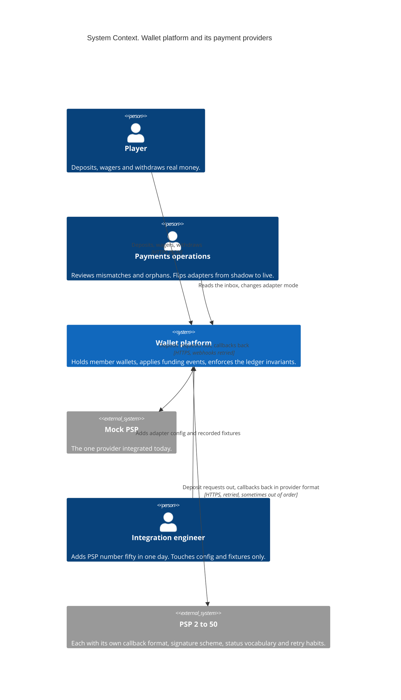
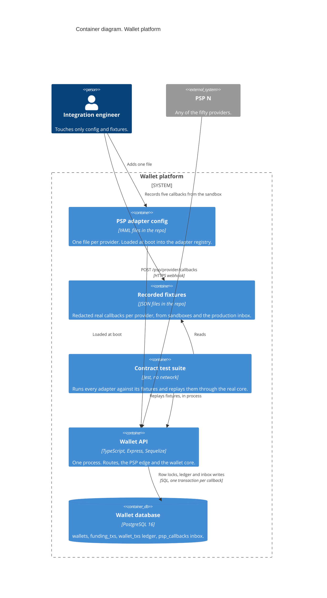
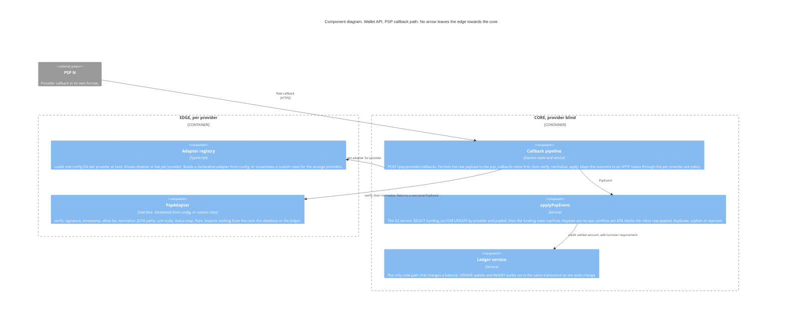
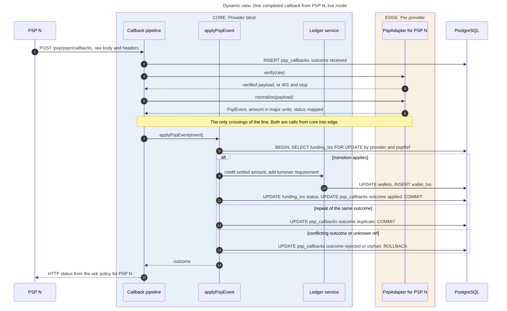

# DESIGN-PSP: the 50th PSP

**Question.** How does a junior engineer integrate a new PSP in one day without being able to break the wallet?

**Answer in one line.** Providers are adapters that turn a raw HTTP delivery into one canonical event. The wallet core consumes only canonical events, never provider payloads, and a shared contract test suite decides whether an adapter is allowed to go live.

## The sketch, as C4

Four views following the [C4 model](https://c4model.com/diagrams): System Context, Container, Component, and a Dynamic view of one callback. The Code and Deployment levels are omitted because they add nothing to this question. The Component diagram carries the whole argument: the boundary between the **edge** and the **core** is the line a PSP integration never crosses.

### Level 1: System Context



### Level 2: Container



### Level 3: Component, the line



The edge is owned by the integration engineer and is what changes per provider. The core is owned by the wallet team, is provider blind, and is exactly the A2 service from Part A with `pspRef` widened to `(provider, pspRef)`. Every arrow into the edge comes from the core, through the `PspAdapter` interface. No arrow leaves the edge towards the core, the database or the ledger. That is the property the ESLint import rule and CODEOWNERS enforce, and it is why an adapter cannot move money.

### Dynamic view: one callback in live mode

The C4 model draws dynamic diagrams as either collaboration or sequence diagrams. A sequence reads better here because the ordering is the point.



In shadow mode the pipeline stops after step 6, logs the event it would have applied, and returns the ack. Everything else is unchanged.

## The abstraction

```ts
// The only thing the core ever sees.
interface PspEvent {
  provider: string;              // 'mockpsp', 'adyen', ...
  pspRef: string;                // our reference, echoed back
  providerEventId: string;       // their id, for dedup across redeliveries
  status: 'pending' | 'completed' | 'failed';
  amount: string;                // major units, decimal string, already scaled
  currency: string;
  receivedAt: Date;
  raw: unknown;                  // kept for the inbox, never read by the core
}

interface PspAdapter {
  readonly name: string;
  verify(req: RawRequest): Promise<VerifiedPayload>;   // throws on bad signature
  normalize(payload: VerifiedPayload): PspEvent;       // pure; no I/O, no wallet imports
  ackPolicy: { onOrphan: 200 | 404; onConflict: 200 | 409 };
}
```

Adapters import nothing from `services/` or `db/`. An ESLint `no-restricted-imports` rule on `src/psp/adapters/**` enforces that, and CODEOWNERS on `src/services/**` and `src/domain/**` means a PSP pull request cannot change the core without a wallet owner's review.

## Where the quirks die

| Quirk | Where it is absorbed |
|---|---|
| Amounts in minor units (`10050` for 100.50) | `unitScale: 2` in adapter config; `normalize` divides with BigNumber. The core never sees minor units. |
| Their status vocabulary (`AUTHORISED`, `SETTLED`, `CHARGEBACK`) | `statusMap` in config to the three canonical statuses; unknown values are rejected at the edge with an alert, never guessed. |
| `success` arrives before `pending` | Nothing to do. The core state machine is monotonic: a `pending` after `Completed` is a no-op, not a regression. |
| Aggressive retries | Inbox dedup on `(provider, providerEventId)`, then the Part A lock and state guard. Ack policy returns 200 to stop the storm. |
| Signature schemes (HMAC header, JWS body, IP allow-list) | `verify()`. Declarative adapter supports HMAC-over-body with a configurable header and secret ref; anything else is a small custom class. |
| Reference in a different JSON path | `refPath`, `amountPath`, `statusPath` as JSON pointers in config. |

## Config over code

Most providers need **no code**. A declarative adapter is built from one file:

```yaml
# config/psp/acmepay.yaml
name: acmepay
verify: { type: hmac-sha256, header: X-Acme-Signature, secretRef: env:ACMEPAY_SECRET }
fields: { ref: /merchantReference, amount: /amount/value, status: /eventType, eventId: /id, currency: /amount/currency }
unitScale: 2
statusMap: { AUTHORISED: pending, SETTLED: completed, REFUSED: failed, CANCELLED: failed }
ack: { onOrphan: 200, onConflict: 200 }
mode: shadow          # shadow | live
```

The registry loads every file at boot. `mode: shadow` means verify, normalize, write the canonical event to the inbox, log what *would* have happened, and do not call `applyPspEvent`. Flipping to `live` is a config change per provider, reviewable and reversible.

## Testing a provider you cannot call in CI

1. **Contract suite, shared by every adapter.** One Jest suite parameterised over `src/psp/adapters/*`, fed by `fixtures/psp/<provider>/`. Required fixtures: `valid-completed`, `valid-failed`, `tampered-signature`, `duplicate-delivery`, `minor-units` (if applicable), `out-of-order`, `unknown-ref`. The suite asserts the canonical event produced, that the tampered fixture is rejected, and that replaying every fixture through the real core against Postgres leaves the ledger invariant intact. No network. An adapter without a green contract suite cannot be registered.
2. **Recorded fixtures, not hand-written ones.** Captured from the provider's sandbox during development and, once live, sampled from the production `psp_callbacks` inbox with amounts and identifiers redacted. The inbox from Part A is the replay source; it already stores the raw payload.
3. **Sandbox smoke, nightly, non-blocking.** Hits the provider's sandbox end to end and posts to a channel on failure. The provider's uptime is not our CI's problem.
4. **Shadow mode in staging, then production.** New adapters run in `shadow` for a day of real traffic. The diff between "would have applied" and the incumbent path is the acceptance test.

## The one-day checklist

Morning: copy the adapter template (`npm run psp:new acmepay` scaffolds config, fixtures directory and the suite entry), capture five sandbox fixtures, fill in the config. Afternoon: contract suite green, deploy to staging in shadow mode, open the PR. The PR touches `config/psp/`, `fixtures/psp/` and at most `src/psp/adapters/acmepay.ts`. If it touches anything below the line, CODEOWNERS stops it.
